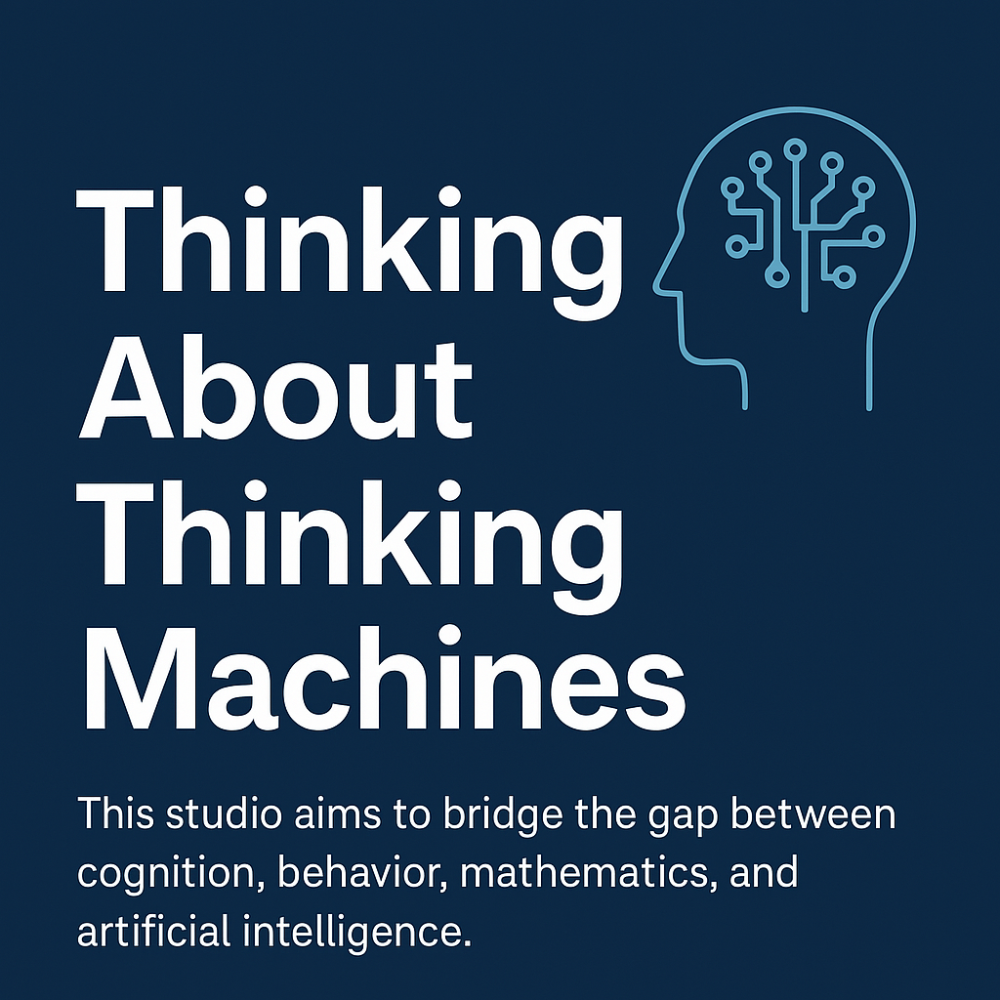

# Thinking About Thinking Machines

## Is the AI hype real?

Each week brings a new headline touting AI’s capabilities, potential, benefits — and inevitable doom.

> “AI is coming for your job, Bitcoin might be the only way out, says Jeff Booth” — *Crypto on the streets*  
> “Tech Leaders Sound a Warning for Coders: AI Is Coming for Their Jobs” — *Technology*  
> “Bill Gates claims three professions will remain indispensable (for now) but “AI will replace humans for most things” eventually” — *Kevin Okemwa*  
> “AI will soon be smarter than human” — *The Seattle Times*

Topics range from AI taking our jobs, to AI taking over the world. AGI is confused with AI and ASI. One article promises salvation, the next forecasts collapse. While there are valid concerns, much of the discourse around AI is sensational and hyperbolic.

CognitiveMLStudio exists to offer a different perspective. This space is dedicated to bridging the gap between cognition, behavior, mathematics, and artificial intelligence. The goal is to help those interested in developing a deeper, more integrated understanding of these fields.

---

## Why This Studio Exists

My academic journey began with a bachelor’s degree in psychology, where I was drawn to cognitive science, behavior, and computational neuroscience. Over time, my love for research and computation led me to pursue a second bachelor’s degree in mathematics. I later earned a master’s degree in mathematics and statistics, where I was first introduced to machine learning. This field felt like a beautiful combination of neural modeling and algorithmic thinking.

I eventually found myself working as a data scientist, applying many of these concepts in real-world settings. But I wanted to go further. I returned to school for a second master’s degree in Artificial Intelligence, and in many ways, it felt like coming full circle; back to my original interests in cognition, behavior, and computational neuroscience. Artificial intelligence brought all of these threads together.

Why start blogging about this topic area? Too often, AI blogs chase hype or focus narrowly on tools and tech stacks, without grounding in theory. Many of the connections between machine learning and cognitive science remain locked in academic journals or scattered across disciplines. This studio aims to bridge that gap, and bring together cognition, behavior, mathematics, and artificial intelligence in one space.

---

## What Readers Can Expect

Readers can expect content that blends rigor with curiosity. Topics will include:

- Technical deep dives into mathematics, algorithms, and neural models  
- Cross-disciplinary explainers on topics like Hebbian learning, reinforcement, and cognitive architectures  
- Explorations of the historical, philosophical, and scientific roots of artificial intelligence  
- Occasional code projects and experiments that connect theory to practice  

---

## Who is this for?

This space is for anyone who wants to think more deeply about how minds — biological and artificial — learn, reason, and adapt. That includes:

- Those interested in the intersection of AI, cognitive science, and mathematics  
- Graduate students, autodidacts, and lifelong learners  
- ML engineers and data scientists curious about the “why” behind the models  
- Cognitive scientists and psychologists exploring AI from the other side  

As I build this out, I want to invite readers to explore, question, and build alongside me. I’m always learning, and I hope this studio carries that same spirit.

---

## What’s Next

I do not yet have a set publishing cadence. I work full time as a data scientist, so I will be building this space gradually, with the goal of posting once a month.

In the next post, we will dive into the cognitive roots of machine learning, and explore how psychology and neuroscience laid the groundwork for today’s AI models.
